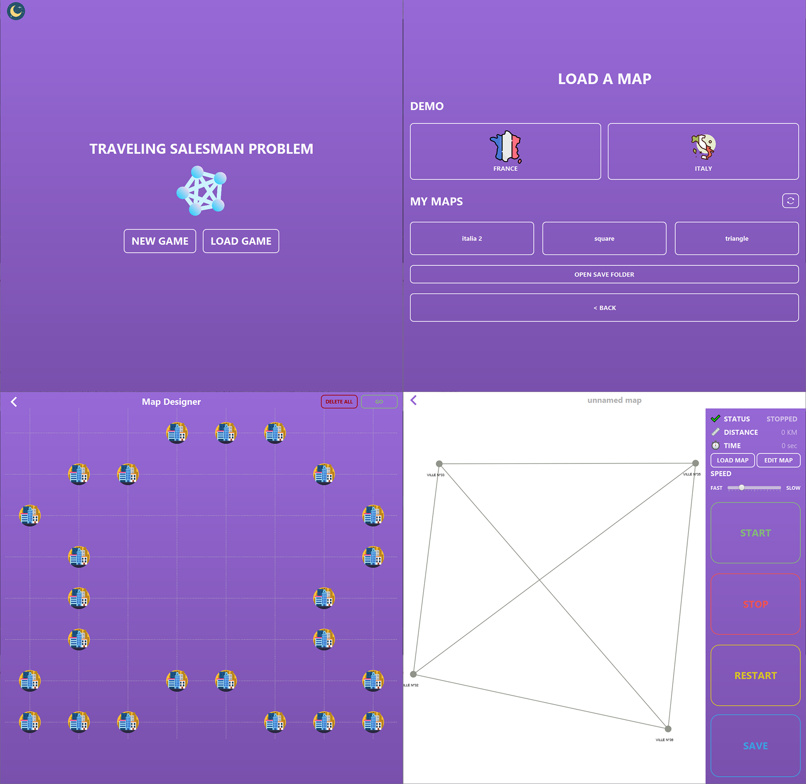

  

This software is an easy to use traveling salesman problem interface which allow you to demonstrate to childrens how the Dijkstra algorithm works.

## Dependencies

- [Java 8](https://www.java.com/fr/download/manual.jsp)
- [JavaFx 2.0](https://www.oracle.com/java/technologies/javafx2-archive-downloads.html)
- [Scene Builder](https://gluonhq.com/products/scene-builder/#download)
- [GraphStream 2.0](https://graphstream-project.org/download/)
- TSPModel_PtiDeb: Incorporated in the repository

## Run the project

- Start the project
  - `tar -zxvf jar.tar`
  - `java -jar APP.jar`
